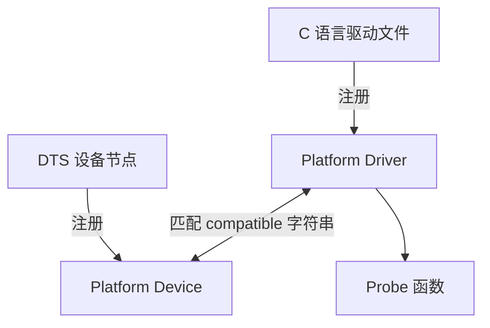

# 第 4 章 - Linux 平台设备驱动 (Platform Driver)

<link rel="stylesheet" href="../npu/assets/print-b5.css">

## 📝 本章总结

本章讲解了 Linux Platform 驱动模型、设备注册、驱动 probe/remove 流程和资源管理。


---

## 📖 本章内容

1. 什么是 Platform Driver？
2. Probe 机制 (匹配与探测)
3. 申请硬件资源 (Memory & IRQ)
4. 注册字符设备 (cdev) 暴露给应用层
5. 驱动开发的标准流程

---

## 1. 什么是 Platform Driver？

在 Linux 中，板载设备（非热插拔，如 NPU、SPI、I2C 控制器）通常由 **Platform Bus** 管理。



- **Device**: 内核解析 DTS 后生成的结构体，描述硬件。
- **Driver**: 你写的代码，负责操作硬件。

**匹配**：当 `Device` 和 `Driver` 的 `compatible` 字符串对上时，内核就会调用 Driver 的 `probe()` 函数。

---

## 2. Probe 机制 (匹配与探测)

### 2.1 定义 Platform Driver

```c
#include <linux/platform_device.h>

static int npu_probe(struct platform_device *pdev) {
    dev_info(&pdev->dev, "NPU driver probed!\n");
    // 在这里初始化硬件...
    return 0;
}

static const struct of_device_id npu_of_match[] = {
    { .compatible = "verisilicon,vip-npu" },
    {},
};
MODULE_DEVICE_TABLE(of, npu_of_match);

static struct platform_driver npu_driver = {
    .probe = npu_probe,
    .driver = {
        .name = "vip-npu",
        .of_match_table = npu_of_match,
    },
};

module_platform_driver(npu_driver);
```

### 2.2 Probe 函数里做什么？

- 解析设备树属性 (获取中断号、DMA 通道号)。
- 申请寄存器地址映射 (IO Remap)。
- 初始化硬件状态 (复位、配置时钟)。
- 注册字符设备节点 (如 `/dev/npu`)。

---

## 3. 申请硬件资源

### 3.1 内存映射 (IO Remap)

驱动拿到的是物理地址，CPU 必须通过 MMU 映射才能访问。

```c
struct resource *res;
void __iomem *regs;

// 获取 DTS 中的 reg 属性
res = platform_get_resource(pdev, IORESOURCE_MEM, 0);

// 映射到内核虚拟地址空间
regs = devm_ioremap_resource(&pdev->dev, res);
if (IS_ERR(regs))
    return PTR_ERR(regs);

// 现在可以直接读写寄存器了
writel(0x01, regs + 0x04);  // 写寄存器
u32 val = readl(regs);       // 读寄存器
```
**注意**：使用 `devm_` (Device Managed) 前缀的函数，Kernel 会在驱动卸载时**自动释放资源**，防止内存泄漏。

### 3.2 申请中断

```c
int irq;

irq = platform_get_irq(pdev, 0);
if (irq < 0)
    return irq;

// 注册中断处理函数
devm_request_irq(&pdev->dev, irq, npu_irq_handler, 
                 IRQF_SHARED, "npu", npu_drv_data);
```

---

## 4. 注册字符设备 (cdev)

应用层要控制 NPU，通常通过读写 `/dev/npu`。

```c
#include <linux/cdev.h>

struct class *npu_class;
struct device *npu_device;
int devno;

// 1. 分配设备号
alloc_chrdev_region(&devno, 0, 1, "npu");

// 2. 初始化 cdev 并绑定 file_operations
cdev_init(&npu_cdev, &npu_fops);
cdev_add(&npu_cdev, devno, 1);

// 3. 在 /dev/ 下创建节点 (udev 会自动生成文件)
npu_class = class_create("npu");
npu_device = device_create(npu_class, NULL, devno, NULL, "npu");
```

### 4.1 File Operations 结构体

这是驱动与用户态交互的接口：

```c
static int npu_open(struct inode *inode, struct file *filp);
static ssize_t npu_read(struct file *filp, char __user *buf, size_t count, loff_t *f_pos);
static ssize_t npu_write(struct file *filp, const char __user *buf, size_t count, loff_t *f_pos);
static long npu_ioctl(struct file *filp, unsigned int cmd, unsigned long arg);

static struct file_operations npu_fops = {
    .owner = THIS_MODULE,
    .open = npu_open,
    .read = npu_read,
    .write = npu_write,
    .unlocked_ioctl = npu_ioctl,
};
```

- **open**: 初始化设备或获取互斥锁。
- **ioctl**: **NPU 最常用的交互方式**，用于下发复杂的配置参数（比 read/write 更灵活）。

---

## 5. 驱动开发的标准流程

1. **编写 DTS**：添加 NPU 节点。
2. **编写驱动框架**：实现 `probe` 和 `remove`。
3. **验证匹配**：加载驱动，看 log 是否打印 `probe success`。
4. **硬件操作**：使用 `readl/writel` 验证能否读写寄存器。
5. **实现 IO 逻辑**：编写 `ioctl`，实现下发任务、查询状态等功能。
6. **应用层测试**：写一个简单的 C 程序打开 `/dev/npu`，发指令看硬件反应。

---

**最后更新**: 2026-04-21  
**维护者**: 苏亚雷斯 (Suarez)
