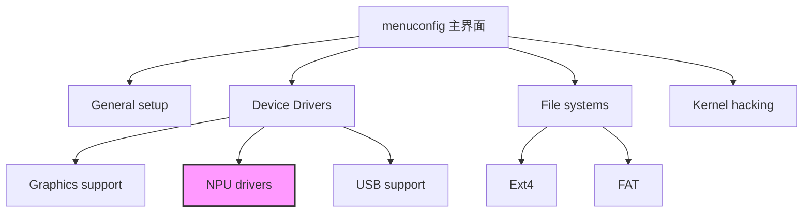

# 第 5 章 - Linux 内核配置与编译
<link rel="stylesheet" href="../npu/assets/print-b5.css">

## 📝 本章总结
本章讲解 Linux 内核源码获取、`.config` 文件与 `menuconfig` 配置、内核模块编译与加载、内核裁剪技巧、设备树覆盖 (Device Tree Overlay)，以及内核 Panic/OOPS 信息解读。

---

## 📖 本章内容
1. 内核源码获取 (kernel.org vs SoC 厂商 BSP)
2. `.config` 文件与 `menuconfig` / `defconfig`
3. 内核模块 (Loadable Module) 编译与加载
4. 常见内核裁剪：关掉不需要的驱动、文件系统
5. 设备树覆盖 (Device Tree Overlay)
6. 排错：内核 Panic、OOPS 信息解读

---

## 1. 内核源码获取 (kernel.org vs SoC 厂商 BSP)

### 1.1 两条路径

| 来源 | 说明 | 适用场景 |
|------|------|----------|
| **kernel.org** | Linux 官方主线内核 | 通用 x86/ARM 开发、学习、标准驱动开发 |
| **SoC 厂商 BSP** | Rockchip/Allwinner/NXP 等厂商维护的分支 | NPU 开发（包含专有驱动、板级支持） |

**NPU 开发强烈建议使用厂商 BSP**，因为主线内核通常不包含 NPU 驱动和定制化电源管理代码。

### 1.2 获取 Rockchip BSP 内核 (示例)

```bash
# 克隆 Rockchip 官方内核仓库
git clone https://github.com/rockchip-linux/kernel.git -b linux-5.10-rockchip
cd kernel

# 查看提交记录，确认包含 NPU 驱动
git log --oneline --grep="npu" | head -10
```

### 1.3 内核目录结构

```
kernel/
├── arch/           # 架构相关代码 (arm, arm64, riscv, x86)
├── drivers/        # 设备驱动 (gpu, npu, i2c, spi...)
├── fs/             # 文件系统 (ext4, fat, nfs...)
├── include/        # 内核头文件
├── init/           # 启动代码 (main.c)
├── kernel/         # 核心子系统 (调度、信号、定时器)
├── mm/             # 内存管理
├── net/            # 网络协议栈
├── .config         # 内核配置文件 (配置后生成)
└── Makefile        # 顶层构建脚本
```

---

## 2. `.config` 文件与 `menuconfig` / `defconfig`

### 2.1 defconfig：板级默认配置

每个开发板都有一个预设的 `defconfig` 文件，位于 `arch/arm64/configs/`。

```bash
# 查看可用的 defconfig
ls arch/arm64/configs/ | grep rockchip
# 输出: rockchip_linux_defconfig

# 加载 defconfig
make ARCH=arm64 CROSS_COMPILE=aarch64-linux-gnu- rockchip_linux_defconfig
# 生成 .config 文件
```

### 2.2 menuconfig：图形化配置

```bash
make ARCH=arm64 CROSS_COMPILE=aarch64-linux-gnu- menuconfig
```

**界面导航：**
- `↑/↓`：移动光标
- `Enter`：进入子菜单
- `Space`：切换选项 `[ ]` (不编译) / `[M]` (模块) / `[*]` (内置)
- `/`：搜索配置项
- `Exit`：退出并保存



### 2.3 保存与加载配置

```bash
# 保存当前配置
cp .config my_custom_defconfig

# 下次直接使用自定义配置
make ARCH=arm64 CROSS_COMPILE=aarch64-linux-gnu- my_custom_defconfig
```

---

## 3. 内核模块 (Loadable Module) 编译与加载

### 3.1 为什么使用模块？

- **灵活**：无需重新编译整个内核，单独编译驱动。
- **节省内存**：按需加载，不用时卸载释放内存。
- **调试方便**：修改驱动后只需 `rmmod` + `insmod`。

### 3.2 模块编译流程

```bash
# 1. 确保内核源码已配置并编译过头文件
make ARCH=arm64 CROSS_COMPILE=aarch64-linux-gnu- modules_prepare

# 2. 编译外部模块 (假设驱动源码在 ../my_npu_driver/)
make ARCH=arm64 CROSS_COMPILE=aarch64-linux-gnu- \
     M=$(pwd)/../my_npu_driver modules

# 输出: my_npu_driver.ko (Kernel Object)
```

### 3.3 模块加载与卸载

```bash
# 加载模块
sudo insmod my_npu_driver.ko

# 查看已加载模块
lsmod | grep npu

# 查看模块日志
dmesg | tail -20

# 卸载模块
sudo rmmod my_npu_driver
```

### 3.4 模块依赖管理

```bash
# 查看模块依赖
modinfo my_npu_driver.ko
# 输出: depends: dmaengine,clk

# 使用 depmod 自动生成依赖关系
sudo depmod -a
sudo modprobe my_npu_driver # 自动加载依赖
```

---

## 4. 常见内核裁剪：关掉不需要的驱动、文件系统

嵌入式设备资源有限，裁剪内核可以显著减少体积和启动时间。

### 4.1 裁剪原则

| 可以裁剪 | 必须保留 |
|----------|----------|
| 不用的文件系统 (CIFS, NFS, XFS) | Rootfs 文件系统 (EXT4, SquashFS) |
| 不用的网络设备 (WiFi, Bluetooth) | 以太网驱动、USB 宿主 |
| 不用的 GPU/显示驱动 | NPU 驱动、DMA 引擎 |
| 调试符号 (`CONFIG_DEBUG_INFO`) | 基础内核功能 |

### 4.2 裁剪前后体积对比

| 配置 | 内核大小 (zImage) | 启动时间 |
|------|-------------------|----------|
| 默认 defconfig | ~18 MB | ~8 秒 |
| 裁剪后 | ~6 MB | ~4 秒 |

### 4.3 常见裁剪配置项

```
# 在 menuconfig 中搜索并禁用:
CONFIG_BLK_DEV_SD=n          # SCSI 磁盘 (不用 SATA 时)
CONFIG_USB_STORAGE=n         # USB 存储设备
CONFIG_INPUT_JOYSTICK=n      # 游戏手柄
CONFIG_SND=n                 # 音频子系统 (无扬声器时)
CONFIG_NETFILTER=n           # 网络防火墙 (无路由需求时)
```

---

## 5. 设备树覆盖 (Device Tree Overlay)

### 5.1 什么是 DT Overlay？

在某些场景下，我们需要在运行时动态加载设备树节点（如插入扩展板、启用额外传感器），而不是重新编译整个 DTB。

### 5.2 编写 Overlay 文件

```dts
// my_sensor_overlay.dts
/dts-v1/;
/plugin/;

/ {
    fragment@0 {
        target = <&i2c1>;
        __overlay__ {
            #address-cells = <1>;
            #size-cells = <0>;
            
            sensor@48 {
                compatible = "ti,tmp102";
                reg = <0x48>;
            };
        };
    };
};
```

### 5.3 编译与应用 Overlay

```bash
# 编译 overlay
dtc -I dts -O dtb -o my_sensor_overlay.dtbo my_sensor_overlay.dts

# 复制到 boot 分区
sudo cp my_sensor_overlay.dtbo /boot/overlays/

# 在 boot 配置中启用 (U-Boot 环境变量)
setenv overlays "my_sensor_overlay"
saveenv
boot
```

**Overlay 加载流程：**


---

## 6. 排错：内核 Panic、OOPS 信息解读

### 6.1 内核 Panic (系统崩溃)

**典型输出：**
```
[  12.345678] Kernel panic - not syncing: VFS: Unable to mount root fs on unknown-block(179,2)
[  12.345678] CPU: 0 PID: 1 Comm: swapper/0 Not tainted 5.10.0-rockchip #1
[  12.345678] Hardware name: Rockchip RK3588 EVB
[  12.345678] Call trace:
[  12.345678]  dump_stack+0x78/0x98
[  12.345678]  panic+0x13c/0x334
[  12.345678]  mount_block_root+0x1f0/0x2b8
```

**解读步骤：**
1. **错误信息**：`Unable to mount root fs` → Rootfs 挂载失败。
2. **设备号**：`unknown-block(179,2)` → 179 是 MMC 设备，2 是分区号。
3. **排查方向**：检查 `bootargs` 中的 `root=` 参数是否正确，确认 SD/eMMC 分区存在。

### 6.2 内核 OOPS (驱动崩溃)

**典型输出：**
```
[  45.678901] Unable to handle kernel NULL pointer dereference at virtual address 0000000000000010
[  45.678901] pc : npu_probe+0x48/0x120 [my_npu_driver]
[  45.678901] lr : platform_drv_probe+0x34/0x80
```

**解读步骤：**
1. **错误类型**：`NULL pointer dereference` → 空指针解引用。
2. **出错位置**：`npu_probe+0x48` → 驱动 `probe` 函数偏移 0x48 处。
3. **排查方向**：检查 `probe` 函数中是否有未初始化的指针访问。

### 6.3 使用 `addr2line` 定位源码

```bash
# 将内核符号地址转换为源码行号
aarch64-linux-gnu-addr2line -e vmlinux 0xffffff8008123456
# 输出: /home/user/kernel/drivers/npu/my_npu_driver.c:128
```

---

## 🔧 实操练习

1. **编译自定义内核**: 下载 Rockchip BSP 内核，使用 `menuconfig` 启用 NPU 驱动（设为模块 `M`），编译并生成 `Image` 和 `my_npu_driver.ko`。
2. **内核裁剪实战**: 对比默认 `defconfig` 与裁剪后的配置，计算体积差异，并在开发板上验证裁剪后内核能正常启动。
3. **OOPS 调试**: 故意在驱动 `probe` 函数中制造空指针解引用，加载模块触发 OOPS，使用 `dmesg` 和 `addr2line` 定位崩溃行号。

---

**最后更新**: 2026-04-22
**维护者**: 苏亚雷斯 (Suarez)