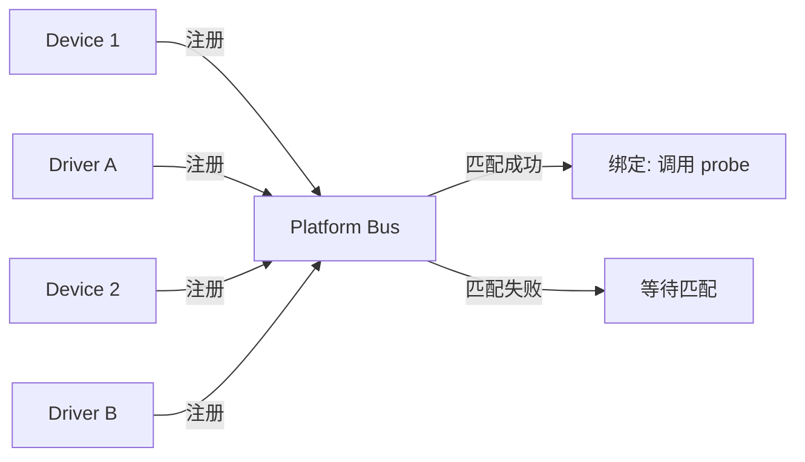
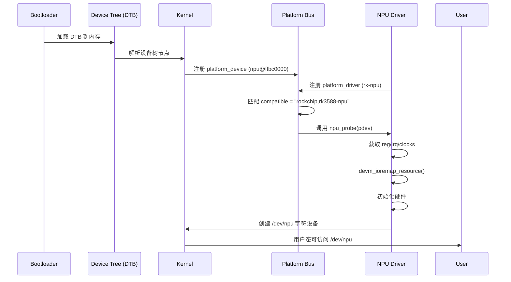

# 第 7 章 - 平台总线与设备模型
<link rel="stylesheet" href="../npu/assets/print-b5.css">

## 📝 本章总结
本章深入讲解 Linux 设备模型三要素（Bus / Device / Driver）、Platform Bus 匹配机制、设备树资源定义、`devm_*` 资源管理 API，以及从 DTS 节点到驱动 Probe 的完整链路。

---

## 📖 本章内容
1. Linux 设备模型三要素：Bus / Device / Driver
2. Platform Bus 匹配机制 (Device Tree compatible / ACPI / ID table)
3. 设备树中的资源定义 (reg、interrupts、clocks、pinctrl)
4. `devm_*` 资源管理 API (自动释放，防止内存泄漏)
5. 驱动注册流程：`platform_driver_register` → probe → remove
6. 实战：从 DTS 节点到驱动 Probe 的完整链路

---

## 1. Linux 设备模型三要素：Bus / Device / Driver

Linux 内核使用统一的设备模型来管理所有硬件。核心是三个抽象：

| 概念 | 说明 | 内核结构 |
|------|------|----------|
| **Bus (总线)** | 设备与驱动的桥梁，负责匹配 | `struct bus_type` |
| **Device (设备)** | 硬件的描述信息 (地址、中断、时钟) | `struct device` |
| **Driver (驱动)** | 硬件的操作方法 (probe、remove、PM) | `struct device_driver` |



### 1.1 匹配流程

```
1. 设备注册: platform_device_register() → 加入 bus 设备列表
2. 驱动注册: platform_driver_register() → 加入 bus 驱动列表
3. Bus 遍历: 对每个新注册的设备/驱动，遍历另一列表查找匹配
4. 匹配条件: compatible 字符串 / ID table / ACPI
5. 绑定成功: 调用 driver->probe(dev)
```

---

## 2. Platform Bus 匹配机制

Platform Bus 是内核中最常用的虚拟总线，用于挂载 SoC 内部集成的外设（如 NPU、DMA、I2C 控制器）。

### 2.1 Device Tree compatible 匹配

**DTS 定义：**
```dts
npu@ffbc0000 {
    compatible = "rockchip,rk3588-npu";
    reg = <0x0 0xffbc0000 0x0 0x10000>;
    interrupts = <GIC_SPI 150 IRQ_TYPE_LEVEL_HIGH>;
    clocks = <&cru CLK_NPU>, <&cru HCLK_NPU>;
};
```

**驱动定义：**
```c
static const struct of_device_id npu_of_match[] = {
    { .compatible = "rockchip,rk3588-npu", .data = &rk3588_npu_data },
    { .compatible = "rockchip,rk3568-npu", .data = &rk3568_npu_data },
    { /* sentinel */ }
};
MODULE_DEVICE_TABLE(of, npu_of_match);

static struct platform_driver npu_driver = {
    .driver = {
        .name = "rk-npu",
        .of_match_table = npu_of_match, // ← 匹配表
    },
    .probe = npu_probe,
    .remove = npu_remove,
};
```

**匹配逻辑：**
内核遍历 `npu_of_match`，比较 DTS 中的 `compatible` 字符串。如果匹配，将 `.data` 指针传给 `probe` 函数。

### 2.2 ID Table 匹配 (备用方案)

当没有设备树时（如老旧板子），可使用 `platform_device_id` 匹配：

```c
static const struct platform_device_id npu_id_table[] = {
    { "rk3588-npu", (kernel_ulong_t)&rk3588_npu_data },
    { "rk3568-npu", (kernel_ulong_t)&rk3568_npu_data },
    { }
};

static struct platform_driver npu_driver = {
    .driver = { .name = "rk-npu" },
    .id_table = npu_id_table, // ← ID 匹配表
    .probe = npu_probe,
};
```

---

## 3. 设备树中的资源定义

### 3.1 reg：内存地址与长度

```dts
reg = <0x0 0xffbc0000 0x0 0x10000>;
// 格式: <address-cells 高32位> <address-cells 低32位> <size-cells 高32位> <size-cells 低32位>
// 含义: 基地址 0xFFBC0000, 长度 0x10000 (64KB)
```

**驱动中获取 reg：**
```c
struct resource *res = platform_get_resource(pdev, IORESOURCE_MEM, 0);
void __iomem *base = devm_ioremap_resource(&pdev->dev, res);
```

### 3.2 interrupts：中断号与类型

```dts
interrupts = <GIC_SPI 150 IRQ_TYPE_LEVEL_HIGH>;
// GIC_SPI: 共享外设中断
// 150: 中断号
// IRQ_TYPE_LEVEL_HIGH: 高电平触发
```

**驱动中获取中断：**
```c
int irq = platform_get_irq(pdev, 0);
devm_request_irq(&pdev->dev, irq, npu_irq_handler, 0, "npu", dev);
```

### 3.3 clocks：时钟控制

```dts
clocks = <&cru CLK_NPU>, <&cru HCLK_NPU>;
clock-names = "clk_npu", "hclk_npu";
```

**驱动中获取时钟：**
```c
struct clk *clk = devm_clk_get(&pdev->dev, "clk_npu");
clk_prepare_enable(clk);
// 使用完毕后 (devm 会自动释放)
```

### 3.4 pinctrl：引脚复用配置

```dts
pinctrl-names = "default";
pinctrl-0 = <&npu_pins_default>;
```

**内核自动处理**：在 `probe` 前自动应用 `pinctrl-0` 配置的引脚状态。

---

## 4. `devm_*` 资源管理 API (自动释放，防止内存泄漏)

### 4.1 什么是 devm？

`devm` (Device Resource Management) 是内核提供的自动资源管理机制。通过 `devm_*` 分配的资源，在驱动 `remove` 或 `probe` 失败时**自动释放**，无需手动 `free`。

### 4.2 常用 devm API 对比

| 传统 API | devm API | 说明 |
|----------|----------|------|
| `kmalloc()` | `devm_kzalloc()` | 内存分配 |
| `ioremap()` | `devm_ioremap_resource()` | IO 内存映射 |
| `clk_get()` | `devm_clk_get()` | 时钟获取 |
| `request_irq()` | `devm_request_irq()` | 中断注册 |
| `regulator_get()` | `devm_regulator_get()` | 电源调节器 |

### 4.3 使用示例

```c
static int npu_probe(struct platform_device *pdev) {
    struct npu_device *npu;
    
    // ✅ 自动释放的内存分配
    npu = devm_kzalloc(&pdev->dev, sizeof(*npu), GFP_KERNEL);
    if (!npu) return -ENOMEM;
    
    // ✅ 自动释放的 IO 映射
    struct resource *res = platform_get_resource(pdev, IORESOURCE_MEM, 0);
    npu->base = devm_ioremap_resource(&pdev->dev, res);
    if (IS_ERR(npu->base)) return PTR_ERR(npu->base);
    
    // ✅ 自动释放的时钟
    npu->clk = devm_clk_get(&pdev->dev, "clk_npu");
    if (IS_ERR(npu->clk)) return PTR_ERR(npu->clk);
    
    // ✅ 自动释放的中断
    int irq = platform_get_irq(pdev, 0);
    int ret = devm_request_irq(&pdev->dev, irq, npu_irq_handler, 0, "npu", npu);
    if (ret) return ret;
    
    // 保存私有数据
    platform_set_drvdata(pdev, npu);
    
    // 如果 probe 后续失败，以上资源全部自动释放！
    return 0;
}

// 使用 devm 后，remove 函数通常只需做硬件关闭操作
static int npu_remove(struct platform_device *pdev) {
    struct npu_device *npu = platform_get_drvdata(pdev);
    npu_hw_disable(npu);
    return 0; // 无需 free/memunmap/clk_put/free_irq！
}
```

**⚠️ 注意**：`devm_*` 资源在 `remove` 时按**相反顺序**自动释放，符合资源管理的最佳实践。

---

## 5. 驱动注册流程：`platform_driver_register` → probe → remove

### 5.1 完整驱动模板

```c
#include <linux/module.h>
#include <linux/platform_device.h>

struct npu_data {
    const char *name;
    uint32_t max_freq;
};

static const struct npu_data rk3588_data = {
    .name = "RK3588 NPU",
    .max_freq = 1000000000, // 1 GHz
};

static const struct of_device_id npu_of_match[] = {
    { .compatible = "rockchip,rk3588-npu", .data = &rk3588_data },
    { /* sentinel */ }
};
MODULE_DEVICE_TABLE(of, npu_of_match);

static int npu_probe(struct platform_device *pdev) {
    const struct of_device_id *match;
    const struct npu_data *data;
    
    // 获取匹配的设备数据
    match = of_match_device(npu_of_match, &pdev->dev);
    if (!match) return -ENODEV;
    data = match->data;
    
    dev_info(&pdev->dev, "Probing %s (max freq: %u Hz)\n", data->name, data->max_freq);
    
    // ... 初始化硬件 ...
    
    return 0;
}

static int npu_remove(struct platform_device *pdev) {
    dev_info(&pdev->dev, "Removing NPU driver\n");
    // ... 关闭硬件 ...
    return 0;
}

static struct platform_driver npu_driver = {
    .probe = npu_probe,
    .remove = npu_remove,
    .driver = {
        .name = "rk-npu",
        .of_match_table = npu_of_match,
    },
};

module_platform_driver(npu_driver); // 宏展开为 module_init/exit
MODULE_LICENSE("GPL");
```

### 5.2 `module_platform_driver` 宏展开

```c
// 等价于:
static int __init npu_driver_init(void) {
    return platform_driver_register(&npu_driver);
}
static void __exit npu_driver_exit(void) {
    platform_driver_unregister(&npu_driver);
}
module_init(npu_driver_init);
module_exit(npu_driver_exit);
```

---

## 6. 实战：从 DTS 节点到驱动 Probe 的完整链路

### 6.1 完整流程示意



### 6.2 调试技巧：查看设备树与驱动绑定状态

```bash
# 查看已解析的设备树
dtc -I fs /sys/firmware/devicetree/base

# 查看 NPU 节点
cat /sys/firmware/devicetree/base/soc/npu@ffbc0000/compatible

# 查看驱动绑定状态
ls -l /sys/bus/platform/drivers/rk-npu/
# 输出: ... npu@ffbc0000 -> ../../../devices/platform/ffbc0000.npu

# 强制解绑与重新绑定
echo "ffbc0000.npu" > /sys/bus/platform/drivers/rk-npu/unbind
echo "ffbc0000.npu" > /sys/bus/platform/drivers/rk-npu/bind
```

---

## 🔧 实操练习

1. **编写 Platform Driver**: 为虚拟 NPU 设备编写完整的 `probe`/`remove` 函数，使用 `devm_*` API 管理资源，并在 `dmesg` 中打印匹配到的 `compatible` 字符串。
2. **修改设备树**: 在 DTS 中添加 NPU 节点，定义 `reg`、`interrupts`、`clocks` 属性，编译 DTB 并验证驱动能正确 Probe。
3. **调试驱动绑定**: 使用 `sysfs` 接口手动解绑/重新绑定驱动，观察 `dmesg` 输出和 `/dev/npu` 节点的创建/销毁。

---

**最后更新**: 2026-04-22
**维护者**: 苏亚雷斯 (Suarez)