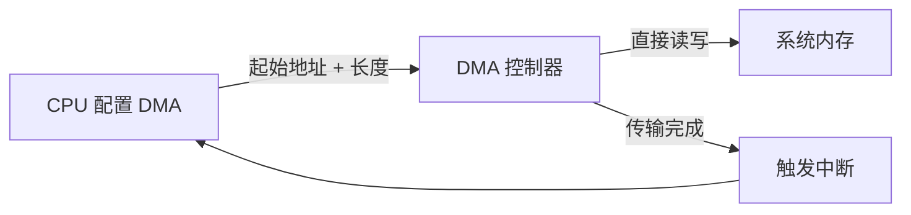

# 第 8 章 - 内存管理与 DMA
<link rel="stylesheet" href="../npu/assets/print-b5.css">

## 📝 本章总结
本章讲解 Linux 内核内存管理基础：`kmalloc`/`vmalloc`/`kzalloc`、物理地址 vs 虚拟地址 vs 总线地址、`ioremap` 内存映射 IO、DMA 基础（一致性映射 vs 流式映射）、CMA 大块内存分配，以及 NPU 场景下的 DMA 缓冲区与零拷贝数据传输。

---

## 📖 本章内容
1. 内核内存分配：`kmalloc` / `vmalloc` / `kzalloc` / `alloc_pages`
2. 物理地址 vs 虚拟地址 vs 总线地址
3. `ioremap` 与 `devm_ioremap_resource` (内存映射 IO)
4. DMA 基础：一致性 DMA 映射 vs 流式 DMA 映射
5. CMA (Contiguous Memory Allocator) 与大块内存分配
6. NPU 场景：为 NPU 预留 DMA 缓冲区、零拷贝数据传输

---

## 1. 内核内存分配：`kmalloc` / `vmalloc` / `kzalloc` / `alloc_pages`

### 1.1 分配函数对比

| 函数 | 内存连续性 | 最大分配 | 适用场景 |
|------|------------|----------|----------|
| `kmalloc(size, flags)` | 物理+虚拟连续 | ~4 MB | 小对象、结构体、缓冲区 |
| `kzalloc(size, flags)` | 物理+虚拟连续 | ~4 MB | 同 `kmalloc`，但自动清零 |
| `vmalloc(size)` | 仅虚拟连续 | 较大 (受虚拟地址空间限制) | 大缓冲区、模块代码 |
| `alloc_pages(flags, order)` | 物理连续 | 2^order 页 (order≤11) | 底层分配，DMA 缓冲 |

### 1.2 GFP 标志 (Get Free Pages)

```c
// 常用 GFP 标志
GFP_KERNEL    // 常规分配，可能睡眠 (进程上下文)
GFP_ATOMIC    // 原子分配，不可睡眠 (中断/锁上下文)
GFP_DMA       // 分配 DMA 兼容内存 (通常 < 16MB)
GFP_DMA32     // 分配 32 位地址兼容内存 (< 4GB)

// 示例
void *buf = kmalloc(1024, GFP_KERNEL);      // 正常分配
void *irq_buf = kmalloc(64, GFP_ATOMIC);    // 中断中分配
```

### 1.3 使用示例

```c
// 推荐：使用 kzalloc 避免未初始化内存泄漏敏感数据
struct npu_task *task = kzalloc(sizeof(*task), GFP_KERNEL);
if (!task) return -ENOMEM;

// 使用完毕必须释放
kfree(task);
```

---

## 2. 物理地址 vs 虚拟地址 vs 总线地址

理解这三种地址是掌握内核内存管理的关键。

```mermaid
graph TD
    CPU[CPU 视角] --> VA[虚拟地址 Virtual Address]
    VA -->|MMU 转换| PA[物理地址 Physical Address]
    PA -->|IOMMU 转换| BA[总线地址 Bus Address / DMA Address]
    BA --> Device[外设视角 (NPU/DMA/PCIe)]
    
    style VA fill:#bbf,stroke:#333
    style PA fill:#fbb,stroke:#333
    style BA fill:#bfb,stroke:#333
```

| 地址类型 | 使用者 | 说明 |
|----------|--------|------|
| **虚拟地址 (VA)** | CPU / 内核代码 | 经过 MMU 映射的地址，驱动中直接解引用 |
| **物理地址 (PA)** | MMU / 启动代码 | 实际 RAM 中的地址，设备树 `reg` 属性使用 |
| **总线地址 (BA)** | DMA 控制器 / 外设 | 外设看到的地址，可能与物理地址不同 (有 IOMMU 时) |

---

## 3. `ioremap` 与 `devm_ioremap_resource` (内存映射 IO)

### 3.1 什么是 MMIO？

硬件寄存器被映射到物理地址空间，CPU 通过读写这些地址来控制硬件。

### 3.2 映射流程

```c
// 1. 从设备树获取资源
struct resource *res = platform_get_resource(pdev, IORESOURCE_MEM, 0);

// 2. 映射到内核虚拟地址空间
void __iomem *base = devm_ioremap_resource(&pdev->dev, res);
if (IS_ERR(base)) return PTR_ERR(base);

// 3. 读写寄存器
writel(0x01, base + 0x00);      // 写入命令寄存器
uint32_t status = readl(base + 0x04); // 读取状态寄存器
```

### 3.3 `readl` / `writel` vs 直接指针访问

```c
// ❌ 错误：直接解引用 (可能被编译器优化，且不保证内存屏障)
uint32_t val = *(volatile uint32_t *)(base + 0x04);

// ✅ 正确：使用内核 IO 访问函数 (保证顺序和屏障)
uint32_t val = readl(base + 0x04);
writel(0x01, base + 0x00);
```

**内核 IO 函数保证：**
- 不会被编译器重排或优化掉。
- 包含适当的内存屏障，确保硬件操作顺序。
- 跨架构兼容 (ARM/x86/RISC-V 行为一致)。

---

## 4. DMA 基础：一致性 DMA 映射 vs 流式 DMA 映射

### 4.1 DMA 工作原理

DMA (Direct Memory Access) 允许外设直接读写内存，无需 CPU 介入。



### 4.2 一致性 DMA 映射 (Coherent / Consistent)

适用于需要长期存在的缓冲区（如 NPU 指令队列、状态共享区）。

```c
// 分配一致性 DMA 缓冲区
dma_addr_t dma_handle;
void *cpu_addr = dma_alloc_coherent(&pdev->dev, size, &dma_handle, GFP_KERNEL);
if (!cpu_addr) return -ENOMEM;

// cpu_addr: CPU 访问的虚拟地址
// dma_handle: 给 NPU/DMA 使用的总线地址

// 使用完毕释放
dma_free_coherent(&pdev->dev, size, cpu_addr, dma_handle);
```

**特点**：
- CPU 和外设看到的内存内容始终一致（硬件自动同步 Cache）。
- 分配较慢，适合小量长期使用的缓冲区。

### 4.3 流式 DMA 映射 (Streaming)

适用于一次性数据传输（如图像帧、推理输入）。

```c
// 1. 分配普通内存
void *buf = kmalloc(size, GFP_KERNEL);

// 2. 映射为 DMA 缓冲区
dma_addr_t dma_addr = dma_map_single(&pdev->dev, buf, size, DMA_TO_DEVICE);
if (dma_mapping_error(&pdev->dev, dma_addr)) {
    kfree(buf);
    return -ENOMEM;
}

// 3. 将 dma_addr 告诉 NPU，启动 DMA 传输
npu_start_dma(dma_addr, size);

// 4. 传输完成后解除映射
dma_unmap_single(&pdev->dev, dma_addr, size, DMA_TO_DEVICE);
kfree(buf);
```

**特点**：
- 可以使用任意内存（包括 `kmalloc` 分配的）。
- 需要手动管理 Cache 同步（`dma_sync_single_for_cpu/device`）。
- 适合大块、临时数据传输。

### 4.4 DMA 映射选择指南

| 场景 | 推荐方案 |
|------|----------|
| NPU 指令队列 (长期使用) | 一致性 DMA (`dma_alloc_coherent`) |
| 图像帧输入 (一次性) | 流式 DMA (`dma_map_single`) |
| 大模型权重 (> 4MB) | CMA + 流式 DMA |
| 小控制结构 (< 1KB) | 一致性 DMA |

---

## 5. CMA (Contiguous Memory Allocator) 与大块内存分配

### 5.1 为什么需要 CMA？

普通 `kmalloc` 无法分配大块连续物理内存（通常限制 ~4MB）。NPU 模型权重、帧缓冲区通常需要几十 MB 到几百 MB 的连续内存。CMA 在系统启动时预留一块内存区域，平时可作为普通内存使用，需要时可回收为连续物理内存。

### 5.2 内核配置

```
# menuconfig 中启用 CMA
CONFIG_CMA=y
CONFIG_DMA_CMA=y
CONFIG_CMA_SIZE_MBYTES=256  # 预留 256MB
```

### 5.3 设备树定义 CMA 区域

```dts
reserved-memory {
    #address-cells = <2>;
    #size-cells = <2>;
    ranges;

    npu_cma: npu-cma@50000000 {
        compatible = "shared-dma-pool";
        reg = <0 0x50000000 0 0x20000000>; // 512MB
        reusable;
        status = "okay";
    };
};

npu@ffbc0000 {
    compatible = "rockchip,rk3588-npu";
    memory-region = <&npu_cma>; // 引用 CMA 区域
};
```

### 5.4 驱动中使用 CMA

```c
// 使用 dma_alloc_coherent 时，内核自动从 CMA 区域分配 (如果配置了)
void *buf = dma_alloc_coherent(&pdev->dev, 64 * 1024 * 1024, &dma_handle, GFP_KERNEL);
// 成功分配 64MB 连续物理内存！
```

---

## 6. NPU 场景：为 NPU 预留 DMA 缓冲区、零拷贝数据传输

### 6.1 零拷贝 (Zero-Copy) 架构

传统数据流：`用户态 buffer → 内核拷贝 → DMA buffer → NPU` (2 次拷贝)
零拷贝数据流：`用户态 mmap → 直接 DMA buffer → NPU` (0 次拷贝)

```mermaid
graph TD
    subgraph 传统方式 (2 次拷贝)
        U1[用户态数据] -->|copy_to_user| K1[内核缓冲区]
        K1 -->|dma_map| D1[DMA 缓冲区]
        D1 --> NPU1[NPU 推理]
    end
    
    subgraph 零拷贝方式 (mmap)
        U2[用户态数据] -->|直接写入| D2[DMA 缓冲区 mmap]
        D2 --> NPU2[NPU 推理]
    end
    
    style D2 fill:#f9f,stroke:#333
```

### 6.2 实现 mmap 零拷贝

```c
static int npu_mmap(struct file *filp, struct vm_area_struct *vma) {
    struct npu_device *npu = filp->private_data;
    size_t size = vma->vm_end - vma->vm_start;
    
    // 将 DMA 缓冲区映射到用户空间
    int ret = remap_pfn_range(vma, vma->vm_start,
                              npu->dma_pfn, size, vma->vm_page_prot);
    if (ret) {
        dev_err(npu->dev, "mmap failed: %d\n", ret);
        return ret;
    }
    
    return 0;
}

// 用户态使用
int fd = open("/dev/npu", O_RDWR);
void *dma_buf = mmap(NULL, buf_size, PROT_READ | PROT_WRITE, MAP_SHARED, fd, 0);

// 直接写入 DMA 缓冲区，无需 copy_to_user!
memcpy(dma_buf, input_image, image_size);

// 通知 NPU 开始推理
ioctl(fd, NPU_IOC_RUN, &task);
```

### 6.3 DMABUF 共享 (跨设备零拷贝)

当 NPU 需要与 GPU/摄像头共享内存时，使用 DMA-BUF 框架：

```c
#include <linux/dma-buf.h>

// 导出 DMA-BUF
struct dma_buf *dmabuf = dma_buf_export(npu->dma_buf, &dma_buf_ops, size, O_RDWR);

// 其他驱动 (如 V4L2 摄像头) 可以导入此 DMABUF
// 实现真正的零拷贝数据共享
```

---

## 🔧 实操练习

1. **DMA 一致性映射实验**: 分配 1KB 一致性 DMA 缓冲区，CPU 写入数据，模拟 NPU 读取，验证 Cache 一致性。
2. **流式 DMA 映射**: 分配 4MB 普通内存，映射为 DMA 缓冲区，模拟数据传输，验证 `dma_sync_single_for_cpu` 的必要性。
3. **mmap 零拷贝驱动**: 为 NPU 驱动添加 `mmap` 支持，编写用户态程序直接写入 DMA 缓冲区，对比 `write()` 与 `mmap()` 的性能差异。

---

**最后更新**: 2026-04-22
**维护者**: 苏亚雷斯 (Suarez)