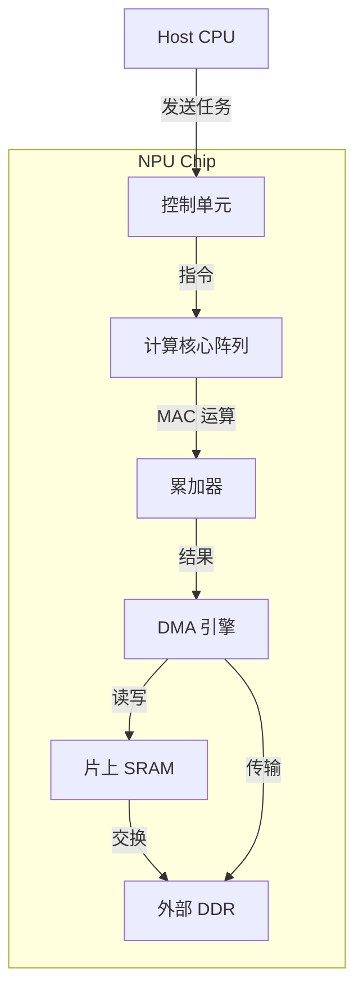
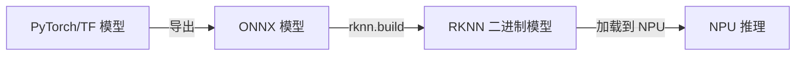
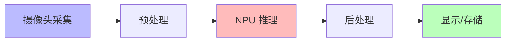

# 第 11 章 - NPU 软件栈集成
<link rel="stylesheet" href="../npu/assets/print-b5.css">

## 📝 本章总结
本章讲解 NPU 芯片架构概览、NPU 驱动加载与 `/dev/npu` 节点、模型编译 (ONNX → NPU 专用格式)、用户态 SDK 集成、性能优化技巧，以及在板子上跑通第一个 NPU 推理 demo。

---

## 📖 本章内容
1. NPU 芯片架构概览 (算力、内存、DMA 引擎)
2. NPU 驱动加载与 `/dev/npu` 节点
3. 模型编译：ONNX → NPU 专用格式 (如 RKNN / TIM-VX)
4. 用户态 SDK 集成：librknn_api / 自研推理框架
5. 性能优化：内存复用、多核并行、流水线推理
6. 实战：在板子上跑通第一个 NPU 推理 demo

---

## 1. NPU 芯片架构概览 (算力、内存、DMA 引擎)

### 1.1 NPU 与 CPU/GPU 的区别

| 处理器 | 擅长任务 | 算力 (TOPS) | 功耗 | 编程模型 |
|--------|----------|-------------|------|----------|
| **CPU** | 控制流、复杂逻辑 | ~0.1 | 低 | C/C++ |
| **GPU** | 并行计算、图形渲染 | ~1-5 | 中 | CUDA/OpenCL |
| **NPU** | AI 推理 (矩阵乘法、卷积) | ~6-20+ | 低 | SDK/API |

### 1.2 NPU 内部架构



**关键组件：**
- **计算核心**：执行卷积、矩阵乘法、激活函数等 AI 算子。
- **片上 SRAM**：高速缓存，减少访问外部 DDR 的延迟。
- **DMA 引擎**：在 DDR 与 SRAM 之间搬运数据，无需 CPU 介入。
- **控制单元**：解析指令流，调度计算核心与 DMA。

---

## 2. NPU 驱动加载与 `/dev/npu` 节点

### 2.1 驱动加载流程

```bash
# 检查驱动是否已加载
lsmod | grep npu

# 手动加载
insmod /lib/modules/$(uname -r)/kernel/drivers/npu/npu.ko

# 查看设备节点
ls -l /dev/npu
# 输出: crw-rw---- 1 root video 240, 0 Apr 22 10:00 /dev/npu
```

### 2.2 驱动与硬件通信

```c
// 打开设备
int fd = open("/dev/npu", O_RDWR);
if (fd < 0) {
    perror("Failed to open /dev/npu");
    return -1;
}

// 查询驱动版本
uint32_t version;
ioctl(fd, NPU_IOC_GET_VERSION, &version);
printf("NPU Driver Version: %d.%d\n", version >> 16, version & 0xFFFF);

// 关闭设备
close(fd);
```

---

## 3. 模型编译：ONNX → NPU 专用格式

### 3.1 为什么需要模型编译？

NPU 硬件不直接执行 TensorFlow/PyTorch 模型。需要转换为：
1. **计算图优化**：融合卷积+BN+激活、常量折叠、算子替换。
2. **量化**：FP32 → INT8/INT16，减少内存占用，提升推理速度。
3. **指令生成**：将计算图编译为 NPU 硬件可执行的二进制指令。

### 3.2 Rockchip RKNN Toolkit 2 流程



```python
from rknn.api import RKNN

# 1. 初始化
rknn = RKNN()

# 2. 配置
rknn.config(
    target_platform='rk3588',
    optimization_level=3  # 0-3，越高优化越强
)

# 3. 加载 ONNX 模型
ret = rknn.load_onnx(model='./yolov5s.onnx')

# 4. 构建 (量化 + 编译)
ret = rknn.build(do_quantization=True, dataset='./calibration.txt')

# 5. 导出 RKNN 模型
rknn.export_rknn('./yolov5s.rknn')
```

### 3.3 校准数据集 (Calibration Dataset)

量化需要代表性数据计算激活值分布：

```
# calibration.txt
./images/img001.jpg
./images/img002.jpg
...
./images/img099.jpg
```

---

## 4. 用户态 SDK 集成：librknn_api

### 4.1 C API 基础用法

```c
#include "rknn_api.h"

// 1. 初始化上下文
rknn_context ctx;
int ret = rknn_init(&ctx, "yolov5s.rknn", 0, 0, NULL);

// 2. 查询输入输出信息
rknn_input_output_num io_num;
rknn_query(ctx, RKNN_QUERY_IN_OUT_NUM, &io_num, sizeof(io_num));

// 3. 设置输入
rknn_input inputs[1];
inputs[0].index = 0;
inputs[0].type = RKNN_TENSOR_UINT8;
inputs[0].size = 640 * 640 * 3;
inputs[0].fmt = RKNN_TENSOR_NHWC;
inputs[0].buf = image_data; // 图像数据指针
rknn_inputs_set(ctx, 1, inputs);

// 4. 执行推理
rknn_run(ctx, NULL);

// 5. 获取输出
rknn_output outputs[3];
for (int i = 0; i < 3; i++) {
    outputs[i].index = i;
    outputs[i].want_float = 1;
}
rknn_outputs_get(ctx, 3, outputs, NULL);

// 6. 处理结果 (解析检测结果)
parse_yolov5_outputs(outputs, 3);

// 7. 释放
rknn_outputs_release(ctx, 3, outputs);
rknn_destroy(ctx);
```

### 4.2 错误处理

```c
const char *rknn_strerror(int ret) {
    switch (ret) {
        case RKNN_SUCC: return "Success";
        case RKNN_ERR_FAIL: return "General error";
        case RKNN_ERR_TIMEOUT: return "Timeout";
        case RKNN_ERR_DEVICE_UNAVAILABLE: return "NPU device unavailable";
        case RKNN_ERR_MALLOC_FAIL: return "Memory allocation failed";
        default: return "Unknown error";
    }
}

#define RKNN_CHECK(expr) do { \
    int ret = (expr); \
    if (ret != RKNN_SUCC) { \
        fprintf(stderr, "RKNN Error at %s:%d: %s\n", \
                __FILE__, __LINE__, rknn_strerror(ret)); \
        return ret; \
    } \
} while(0)
```

---

## 5. 性能优化：内存复用、多核并行、流水线推理

### 5.1 内存复用 (避免重复分配)

```c
// ❌ 每次推理都分配内存 (慢)
for (int i = 0; i < 1000; i++) {
    void *buf = malloc(image_size);
    // ... 推理 ...
    free(buf);
}

// ✅ 预分配，复用内存 (快)
void *input_buf = malloc(image_size);
void *output_buf = malloc(output_size);

for (int i = 0; i < 1000; i++) {
    // 直接复用 buf，无需重新分配
    inputs[0].buf = input_buf;
    rknn_run(ctx, NULL);
    process_outputs(output_buf);
}

free(input_buf);
free(output_buf);
```

### 5.2 多 NPU 核心并行

RK3588 有 3 个 NPU 核心，可同时推理 3 个模型：

```c
rknn_context ctx[3];

// 初始化 3 个上下文
for (int i = 0; i < 3; i++) {
    rknn_init(&ctx[i], model_paths[i], 0, 0, NULL);
}

// 并行推理
#pragma omp parallel for
for (int i = 0; i < 3; i++) {
    rknn_run(ctx[i], NULL);
}
```

### 5.3 流水线推理 (Pipeline)



**实现**：使用 3 个线程 + 2 个 Ring Buffer：
- 线程 1：采集 → 写入 Ring Buffer 1
- 线程 2：从 Ring Buffer 1 读取 → NPU 推理 → 写入 Ring Buffer 2
- 线程 3：从 Ring Buffer 2 读取 → 后处理 → 显示

---

## 6. 实战：在板子上跑通第一个 NPU 推理 demo

### 6.1 环境准备

```bash
# 1. 安装 RKNN Toolkit 2 运行时
sudo dpkg -i rknn-runtime-linux-aarch64.deb

# 2. 拷贝模型文件
scp yolov5s.rknn root@192.168.1.100:/root/
scp test.jpg root@192.168.1.100:/root/

# 3. 编译测试程序
aarch64-linux-gnu-gcc -o yolov5_demo yolov5_demo.c -lrknn_api
scp yolov5_demo root@192.168.1.100:/root/
```

### 6.2 运行与验证

```bash
# SSH 登录目标板
ssh root@192.168.1.100

# 运行 demo
./yolov5_demo yolov5s.rknn test.jpg

# 输出:
# NPU Driver Version: 1.2.0
# Model loaded successfully
# Inference time: 12.3 ms
# Detected: person (0.92) at [100, 200, 300, 500]
# Detected: dog (0.87) at [400, 150, 550, 400]
```

### 6.3 性能基准测试

```bash
# 运行 100 次，计算平均耗时
./yolov5_demo yolov5s.rknn test.jpg --benchmark 100

# 输出:
# Avg inference time: 11.8 ms (84.7 FPS)
# CPU usage: 15%
# NPU temperature: 52°C
```

---

## 🔧 实操练习

1. **模型转换实战**: 下载一个开源 ONNX 模型 (如 MobileNetV2)，使用 RKNN Toolkit 2 转换为 `.rknn` 格式，量化并验证精度损失。
2. **编写 C 推理程序**: 使用 `rknn_api` 编写完整的图像分类程序，加载模型、预处理图像、执行推理、打印 Top-5 结果。
3. **流水线优化**: 将第 5.3 节的流水线架构实现为多线程程序，对比单线程与流水线的吞吐量差异。

---

**最后更新**: 2026-04-22
**维护者**: 苏亚雷斯 (Suarez)