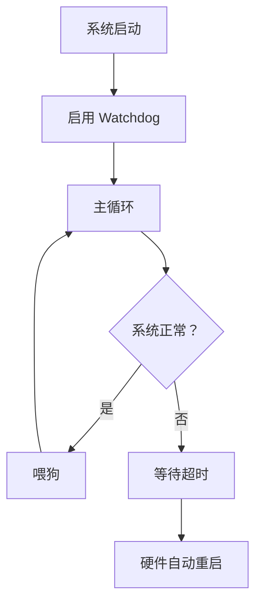
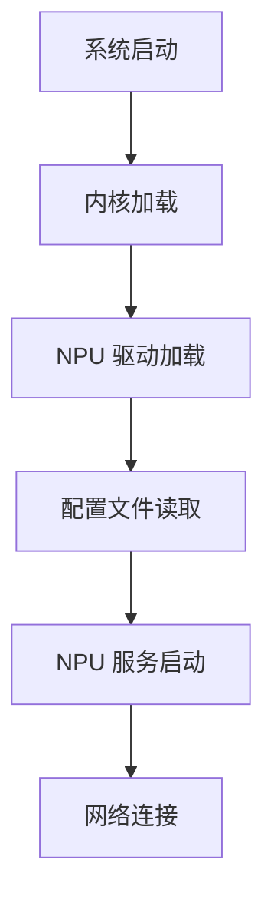
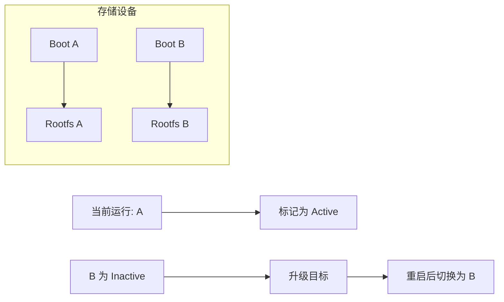

# 第 12 章 - 系统调优与生产部署
<link rel="stylesheet" href="../npu/assets/print-b5.css">

## 📝 本章总结
本章讲解内核启动参数调优、CPU 频率调节 (cpufreq)、看门狗 (Watchdog) 配置与系统自愈、开机自启与 systemd service 编写、OTA 升级方案设计，以及生产环境监控 (温度、内存泄漏、coredump)。

---

## 📖 本章内容
1. 内核启动参数调优 (console、rootwait、elevator)
2. CPU 频率调节 (cpufreq / governor / 性能 vs 功耗)
3. 看门狗 (Watchdog) 配置与系统自愈
4. 开机自启与 systemd service 编写
5. OTA 升级方案设计 (A/B 分区、差分包)
6. 生产环境监控：温度、内存泄漏、核心转储 (coredump)

---

## 1. 内核启动参数调优 (console、rootwait、elevator)

### 1.1 `bootargs` 关键参数

```
console=ttyS0,115200n8          # 串口控制台 (波特率 115200, 8N1)
root=/dev/mmcblk0p2             # Rootfs 分区
rootwait                        # 等待存储设备就绪后再挂载
rootfstype=ext4                 # 文件系统类型
rw                              # 读写模式 (默认 ro)
elevator=noop                   # I/O 调度器 (嵌入式推荐 noop)
```

### 1.2 I/O 调度器选择

| 调度器 | 说明 | 适用场景 |
|--------|------|----------|
| `noop` | 最简单，FIFO 队列 | SSD/eMMC (无机械延迟) |
| `deadline` | 保证请求延迟上限 | 混合存储 |
| `bfq` | 公平队列，防止饥饿 | 桌面/服务器 |
| `cfq` | 完全公平队列 (已废弃) | 不推荐 |

**设置方法：**
```bash
# 启动参数中添加
elevator=noop

# 运行时查看/修改
cat /sys/block/mmcblk0/queue/scheduler
# 输出: [noop] deadline bfq
echo deadline > /sys/block/mmcblk0/queue/scheduler
```

---

## 2. CPU 频率调节 (cpufreq / governor / 性能 vs 功耗)

### 2.1 什么是 cpufreq？

Linux 通过 cpufreq 子系统动态调整 CPU 频率，平衡性能与功耗。

### 2.2 可用 Governor (调速器)

```bash
# 查看可用 governor
cat /sys/devices/system/cpu/cpu0/cpufreq/scaling_available_governors
# 输出: conservative ondemand userspace powersave performance schedutil

# 查看当前 governor
cat /sys/devices/system/cpu/cpu0/cpufreq/scaling_governor
```

| Governor | 行为 | 适用场景 |
|----------|------|----------|
| `performance` | 固定最高频率 | NPU 推理、实时处理 |
| `powersave` | 固定最低频率 | 待机、低功耗模式 |
| `schedutil` | 根据调度器负载动态调整 | 默认推荐 |
| `ondemand` | 按需升频 (较老) | 旧内核兼容 |

### 2.3 切换到性能模式 (NPU 推理前)

```bash
# 临时设置 (重启失效)
echo performance > /sys/devices/system/cpu/cpu0/cpufreq/scaling_governor
echo performance > /sys/devices/system/cpu/cpu1/cpufreq/scaling_governor
# ... 对所有 CPU 核心执行

# 查看当前频率
cat /sys/devices/system/cpu/cpu0/cpufreq/scaling_cur_freq
# 输出: 1800000 (1.8 GHz)
```

### 2.4 持久化配置

```bash
# 使用 cpufreq-set (需要 cpufrequtils)
cpufreq-set -g performance

# 或添加到 /etc/rc.local
#!/bin/sh
for cpu in /sys/devices/system/cpu/cpu[0-3]/cpufreq/scaling_governor; do
    echo performance > $cpu
done
```

---

## 3. 看门狗 (Watchdog) 配置与系统自愈

### 3.1 为什么需要 Watchdog？

当系统死锁或内核 Panic 时，Watchdog 会自动重启设备，无需人工干预。

### 3.2 硬件 Watchdog 使用

```bash
# 查看 Watchdog 设备
ls -l /dev/watchdog

# 启动 Watchdog (15 秒超时)
# 必须每 15 秒内写入一次，否则系统重启
while true; do
    echo 1 > /dev/watchdog  # 喂狗
    sleep 10
done &
```

### 3.3 systemd 集成 Watchdog

```ini
# /etc/systemd/system.conf
RuntimeWatchdogSec=15s
ShutdownWatchdogSec=10min
```

systemd 会自动每 7.5 秒 (超时的一半) 喂狗。如果 systemd 或内核崩溃，Watchdog 将在 15 秒后重启系统。

### 3.4 看门狗最佳实践



**注意事项：**
- 仅在确认系统稳定后启用 Watchdog。
- 喂狗间隔应小于超时的 50%。
- 调试阶段禁用 Watchdog，避免频繁重启影响排查。

---

## 4. 开机自启与 systemd service 编写

### 4.1 systemd service 模板

```ini
# /etc/systemd/system/npu-inference.service
[Unit]
Description=NPU Inference Service
After=network.target npu-driver.service
Wants=npu-driver.service

[Service]
Type=simple
ExecStart=/usr/bin/npu_inference --config /etc/npu.conf
Restart=always
RestartSec=5
User=root
Group=root
Environment=NPU_LOG_LEVEL=info

# 资源限制
LimitNOFILE=65536
MemoryMax=512M

[Install]
WantedBy=multi-user.target
```

### 4.2 启用与管理服务

```bash
# 重新加载配置
systemctl daemon-reload

# 启用开机自启
systemctl enable npu-inference.service

# 启动服务
systemctl start npu-inference.service

# 查看状态
systemctl status npu-inference.service

# 查看日志
journalctl -u npu-inference.service -f
```

### 4.3 依赖关系管理



```ini
# npu-driver.service (先启动)
[Unit]
Description=Load NPU Kernel Driver
Before=npu-inference.service

[Service]
Type=oneshot
ExecStart=/sbin/insmod /lib/modules/npu.ko
RemainAfterExit=yes
```

---

## 5. OTA 升级方案设计 (A/B 分区、差分包)

### 5.1 A/B 分区架构



**优势**：
- 升级失败仍可回滚到旧版本。
- 无需停机，后台下载 + 安装，重启切换。

### 5.2 差分升级 (节省带宽)

```bash
# 生成差分包 (Host 端)
bsdiff old_rootfs.img new_rootfs.img update.patch

# 应用差分 (Target 端)
bspatch /dev/mmcblk0p3 update.patch /dev/mmcblk0p4
```

### 5.3 升级脚本示例

```bash
#!/bin/sh
# ota_update.sh

ACTIVE_SLOT=$(cat /etc/active_slot)
if [ "$ACTIVE_SLOT" = "A" ]; then
    TARGET_SLOT="B"
    TARGET_PART="/dev/mmcblk0p4"
else
    TARGET_SLOT="A"
    TARGET_PART="/dev/mmcblk0p3"
fi

echo "Updating slot $TARGET_SLOT..."

# 下载差分包
wget http://server/ota/update.patch -O /tmp/update.patch

# 应用差分
bspatch "$TARGET_PART" /tmp/update.patch /tmp/new_rootfs.img
mv /tmp/new_rootfs.img "$TARGET_PART"

# 切换激活槽
echo "$TARGET_SLOT" > /etc/active_slot
echo "Update complete. Rebooting..."
reboot
```

---

## 6. 生产环境监控：温度、内存泄漏、核心转储 (coredump)

### 6.1 温度监控

```bash
# 查看 SoC 温度
cat /sys/class/thermal/thermal_zone0/temp
# 输出: 52000 (52°C)

# 查看 NPU 温度 (如果有独立传感器)
cat /sys/class/thermal/thermal_zone1/temp

# 高温报警脚本
#!/bin/sh
TEMP=$(cat /sys/class/thermal/thermal_zone0/temp)
if [ "$TEMP" -gt 80000 ]; then
    echo "WARNING: High temperature! ($TEMP)" >> /var/log/temp_alert.log
    # 降频或停止 NPU 推理
    echo powersave > /sys/devices/system/cpu/cpu0/cpufreq/scaling_governor
fi
```

### 6.2 内存泄漏检测

```bash
# 查看进程内存使用
cat /proc/$(pidof npu_inference)/status | grep VmRSS
# 输出: VmRSS: 123456 kB

# 持续监控
watch -n 5 'cat /proc/$(pidof npu_inference)/status | grep VmRSS'
```

### 6.3 核心转储 (Coredump)

当程序崩溃时，生成 coredump 文件用于事后调试。

```bash
# 启用 coredump (临时)
ulimit -c unlimited

# 配置 coredump 路径
echo "/tmp/core.%e.%p" > /proc/sys/kernel/core_pattern

# 程序崩溃后生成 /tmp/core.npu_inference.1234

# 使用 gdb 分析 coredump
aarch64-linux-gnu-gdb /usr/bin/npu_inference /tmp/core.npu_inference.1234
(gdb) bt  # 查看崩溃时的调用栈
```

### 6.4 系统健康检查脚本

```bash
#!/bin/sh
# health_check.sh

echo "=== System Health Check ==="
echo "CPU Temp: $(cat /sys/class/thermal/thermal_zone0/temp | awk '{print $1/1000 "°C"}')"
echo "NPU Status: $(lsmod | grep npu || echo 'Not loaded')"
echo "Memory: $(free -h | awk '/Mem:/ {print $3 "/" $2}')"
echo "Disk: $(df -h / | awk 'NR==2 {print $5 " used"}')"
echo "Uptime: $(uptime -p)"
echo "==========================="
```

---

## 🔧 实操练习

1. **systemd 服务编写**: 为 NPU 推理程序编写完整的 systemd service，包含依赖管理、自动重启、资源限制、日志配置。
2. **Watchdog 配置**: 启用硬件 Watchdog，编写喂狗脚本，模拟系统死锁验证自动重启功能。
3. **Coredump 调试**: 故意制造程序崩溃 (如空指针解引用)，生成 coredump 文件，使用 gdb 分析崩溃原因。

---

**最后更新**: 2026-04-22
**维护者**: 苏亚雷斯 (Suarez)